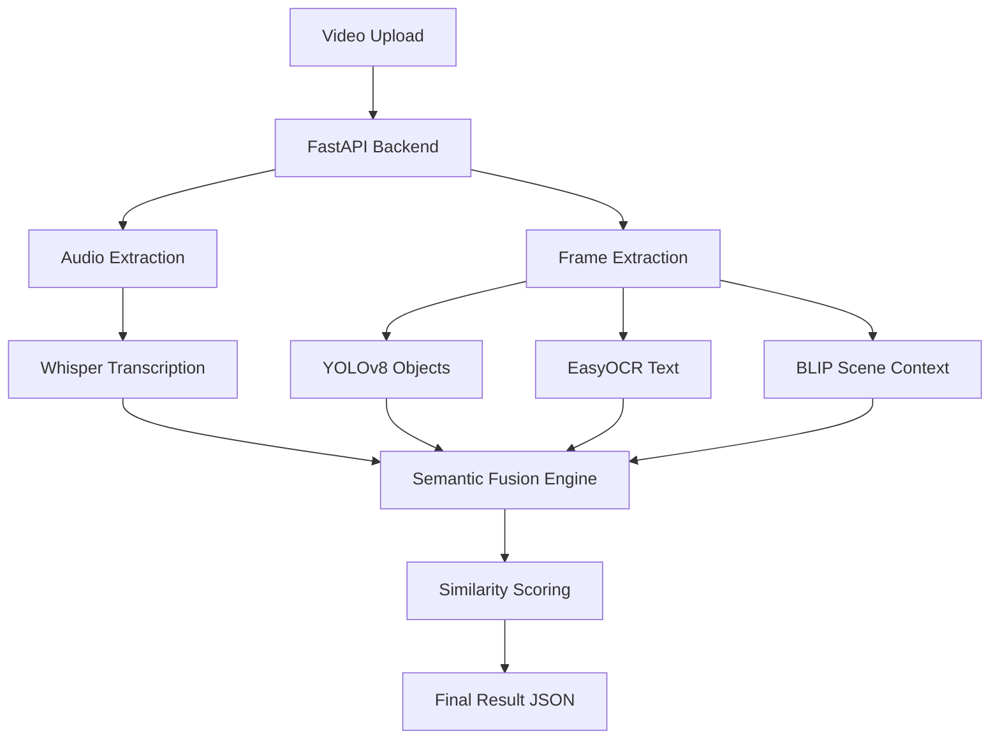

# 🚀 Vocentra — Multimodal Video-to-Text Semantic Understanding

**Vocentra** is an advanced AI-powered platform designed to bridge the gap between video content and semantic understanding. It analyzes speech, visual scenes, objects, and text (OCR) within videos to generate a high-fidelity semantic script and calculate multimodal similarity scores.

Built for the **CR RAO AIMSCS Udhbhav Hackathon MVP**, Vocentra provides educational and professional users with a deep look into the alignment between spoken context and visual cues.

---

## 🎯 Problem Statement

Traditional video-to-text tools only focus on transcription. They miss the rich visual context—objects, whiteboard text, and actions—that define complex educational or technical videos. Vocentra solves this by performing "Semantic Fusion" across audio and visual channels.

## 🧠 Our Solution

Vocentra uses a state-of-the-art AI pipeline to:

1.  **Transcribe Speech**: Using OpenAI Whisper for high-accuracy STT.
2.  **Scene Understanding**: Captioning visual events at regular intervals.
3.  **Object & OCR Detection**: Identifying tools, text, and presenters in every frame.
4.  **Semantic Fusion**: Merging and clustering multimodal data into a structured timeline.
5.  **Similarity Analysis**: Measuring alignment between the video and a reference topic/abstract.

---

## ⚙️ System Architecture

Vocentra follows a modern decoupled architecture:

- **Frontend**: React + Vite with a high-performance Glassmorphism UI.
- **Backend**: FastAPI (Python) orchestrating background AI tasks.
- **AI Pipeline**: Modular engine using YOLOv8, EasyOCR, Whisper, and SentenceTransformers.



---

## 🔬 AI Pipeline Explanation

- **Frame Skipping & Optimization**: We process 1 frame every 2 seconds and skip "blank" or out-of-focus frames to ensure pipeline speed (< 2 mins).
- **Memory Management**: Explicit tensor cache clearing ensures stability on demo hardware.
- **Granular Progress**: Real-time 10%–100% feedback loop for superior UX.

## 📊 Example Output

Vocentra generates a structured "Semantic Script" including:

- **Timeline**: Synced speech, objects, and visual context for every segment.
- **AI Reasoning**: Justification for the calculated similarity score.
- **Visual Context**: List of all unique detected objects and parsed OCR text.

---

## 🛠 Tech Stack

- **UI**: React.js, Framer Motion, CSS Modules (Glassmorphism)
- **Server**: Python, FastAPI, Uvicorn
- **AI**: PyTorch, Ultralytics (YOLOv8), EasyOCR, OpenAI Whisper, HuggingFace Transformers
- **DevOps**: Docker, Pathlib (System Path Normalization)

## 🏗 Installation

1.  **Clone the Repo**:
    ```bash
    git clone https://github.com/vrajeshchary/vocentra
    cd vocentra
    ```
2.  **Environment Setup**:
    ```bash
    pip install -r requirements.txt
    ```
3.  **Frontend Setup**:
    ```bash
    cd frontend
    npm install
    ```

## ▶️ Running the Project

1.  **Start the Full System**:
    ```bash
    # From project root
    python run.py
    ```
    This launches the backend on port 8000 and auto-installs missing AI models.
2.  **Launch Frontend**:
    ```bash
    cd frontend
    npm run dev
    ```

---

## 👨‍💻 The Team — Hacksmiths United

- **M Vrajesh Chary**: Team Lead & AI Systems Engineer
- **M Nithesh**: AI Pipeline Architect
- **Niteesh Reddy Garlapati**: Full Stack Engineer
- **Sardar Jugraj Singh**: Backend & DevOps Engineer

---

## 📈 Future Scope

- **GPU Threading**: Parallelizing sub-model inference for sub-30s processing.
- **LLM Refinement**: Using GPT-4o or Claude 3.5 for even deeper semantic synthesis.
- **Interactive Timeline**: Clickable markers to jump directly to specific visual events in the video.

---

_Created for CR Rao AIMSCS Udhbhav Hackathon 2026._
